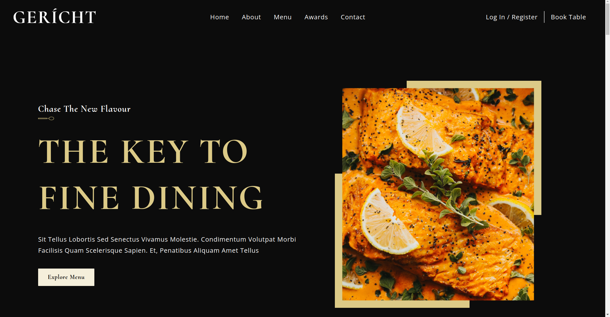

# Restaurant Website
[demo](https://kushaj-restaurant-website.vercel.app/)



Converted Figma design into fully-responsive modern UI/UX website using CSS FlexBox/Grid, animations, and gradients. Built using Next.js/TypeScript/CSS(BEM) and deployed on Vercel.

## Table of Contents
- [Demo Videos](#demo-videos)
    - [Mobile Demo](#mobile-demo)
    - [Tablet Demo](#tablet-demo)
    - [Desktop Demo](#desktop-demo)
- [Dependencies](#dependencies)
- [Local Setup](#local-setup)
- [Directory Setup](#directory-setup)
- [License](#license)

## Demo Videos

### Mobile Demo

https://user-images.githubusercontent.com/24699564/198903817-370a5eef-4385-4999-8f2c-9c20d844d93d.mp4

### Tablet Demo

https://user-images.githubusercontent.com/24699564/198903820-b26a40f5-7492-46eb-b873-0674be108a2b.mp4

### Desktop Demo

https://user-images.githubusercontent.com/24699564/198903825-5693e59b-f22b-425a-9a09-ac97592c6db1.mp4

## Dependencies
- [React](https://reactjs.org/)
- [Next.js](https://nextjs.org/)
- [TypeScript](https://www.typescriptlang.org/)

## Local Setup
**Step 1**. Setup Node.js v16.17.1. [nvm](https://github.com/nvm-sh/nvm) can be used to quickly setup Node.js (and you can also have multiple versions of Node.js).
```
curl -o- https://raw.githubusercontent.com/nvm-sh/nvm/v0.39.1/install.sh | bash
nvm install 16.17.1
```

**Step 2**. Clone the repository and install all the dependencies.
```
git clone https://github.com/KushajveerSingh/restaurant_website
cd restaurant_website
npm install --legacy-peer-deps
```

`--legacy-peer-deps` would install the exact packages as used in the repository. The repository already includes VSCode and Prettier setup, and you can modify the default behavior in `.vscode/settings.json` and `.prettierrc` respectively.

**Step 3**. Create `.env.local` and copy the contents from `.env.example` to `.env.local`.
    - `NEXT_PUBLIC_BASE_URL` - set to `http://localhost:3000/` during development and when you deploy the project on Vercel, set it to the domain where the project is hosted.

**Step 4**. Run `make run dev` to start the local development server at `localhost:3000`. Now you can customize the application as per your needs. Further, look at [Directory Setup](#directory-setup) section to understand how the source code is structured.

**Step 5**. After making the desired changes, you can push your project to GitHub and you are ready for deployment on [Vercel](https://vercel.com/)

**Step 6**. Create an account on [Vercel](https://vercel.com/) and then click **Add New...** -> **Project** and choose your github repository.

And that is it. You have successfully deployed your custom restaurant website to Vercel.

## Directory Setup
- `public`
    - `favicon.ico` - provide your custom favicon here
    - `manifest.json` - the default behavior allows all the files in the repository to be scrapped by the bots
    - `demo_image.png` - provide your custom logo image here. To be used in the meta tags.
- `src`
    - `global.css` - global css classes are defined here. This file is then loaded in `src/pages/_app.tsx`
    - `data.ts` - provide information like awards, available wines and cocktails on the menu
    - `pages`
        - `_app.tsx` - Used by Next.js to define the default layout for all the pages. You don't need to modify it
        - `_document.tsx` - Used by Next.js to define the default HTML that should be loaded for every page. Provide any custom font here
        - `_index.tsx` - Renders root page `/` and also loads the meta tags from `src/components/MetaTags.tsx`

## License
This application has Apache License Version 2.0, as found in the [LICENSE](./LICENSE) file.
